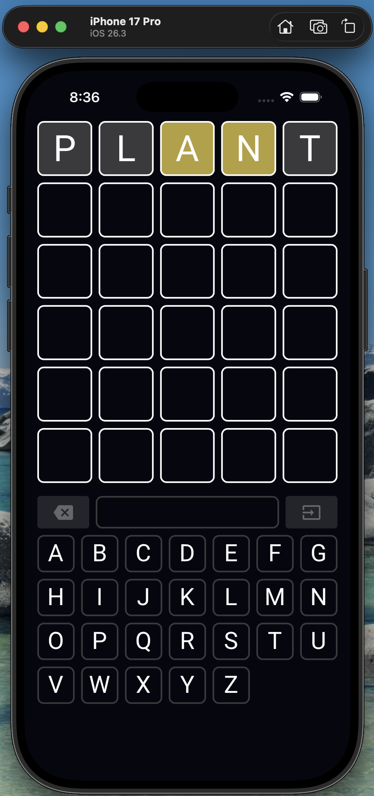

# app_repo

This repo contains a Wails v3 sample app in a monorepo organized to re use components across multiple apps. The target audience is for developers who are proficient in React and Go and want to use those technologies to create mobile and desktop apps. Frontend components are developed in such a way that they can also be reused for web targets.



## Table of Contents

1. [Quickstart](#quickstart)
2. [Project structure](#project-structure)
3. [Docs](#docs)

## Quickstart

* Ensure you have npm installed as described in `docs/DEV_GUIDE.md` 
* `npm install`
* `npm run storybook`

This is the fastest way to preview app components, without setting up emulation and other dependencies

## Project structure

```
cmd/                        # applications, programs, projects
pkg/                        # shared packages
storybook/                  # frontend previews
playground/                 # dev scripting / experimentation
```

## Docs

See 

* [DEV GUIDE](./docs/DEV_GUIDE.md)
* [GO GUIDE](./docs/GO_GUIDE.md)
* [FRONTEND GUIDE](./docs/FRONTEND_GUIDE.md)
* [USING AGENTS](./docs/USING_AGENTS.md)
